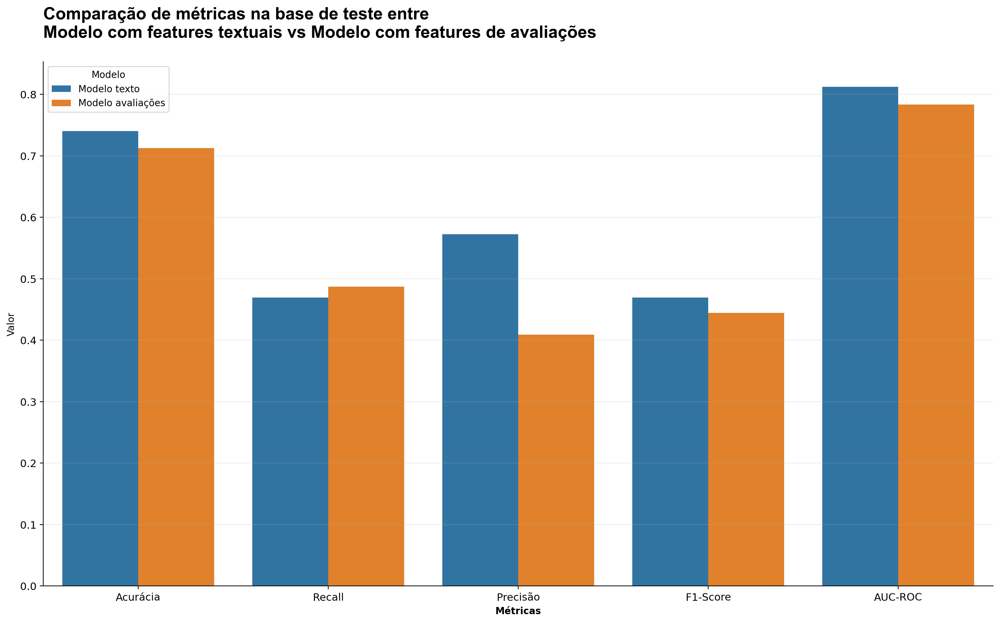

# Case - DataScientist
## Travel_Challenge 


# Conhecendo a base de dados

A base é oriunda de reviews de clientes de companhias aéreas. Ela possui as seguintes colunas:

- **Airline Name**: Nome da companhia aérea que o passageiro avaliou. 

- **Overall_Rating**: Avaliação geral do passageiro.

- **Review_Title**: Título do review. Normalmente, um resumo rápido do que o passageiro achou da experiência.

- **Review Date**: Data em que o review foi feito. 

- **Review**: O conteúdo textual do review, onde o passageiro descreve sua experiência. 

- **Aircraft**: Tipo ou modelo da aeronave usada no voo. 

- **Type Of Traveller**: Tipo de viajante.

- **Seat Type**: Classe do assento escolhido pelo passageiro.

- **Route**: A rota de voo.

- **Date Flown**: Data do voo.

- **Seat Comfort**: Avaliação do conforto do assento.

- **Cabin Staff Service**: Avaliação do serviço da equipe de cabine.

- **Food & Beverages**: Avaliação das comidas e bebidas oferecidas durante o voo. 

- **Ground Service**: Avaliação dos serviços em terra.

- **Inflight Entertainment**: Avaliação do sistema de entretenimento a bordo.

- **Wifi & Connectivity**: Avaliação da conectividade de internet durante o voo.


# Respondendo questões

## 1. Faça uma etapa de processamento dos dados para verificar possíveis dados faltantes ou duplicados.


Utilizando `df.info()` para avaliar a base:
<!-- ```python
# Por meio da função
df.info()
``` -->


Percebe-se que apenas 5 variáveis não possuem valores nulos. 
Avaliando de forma gráfica por meio das seguintes visualizações


É possível perceber a partir dos gráficos acima que os valores nulos estão bastante presentes nas colunas:  
- `Food & Beverages` cerca de **32%**
- `Inflight Entertainment`cerca de **48%**
- `Wifi & Connectivity` cerca de **70%**

Já as demais colunas possuem todas menos de **15%** de valores inválidos
Para tratar disso, adotei a seguinte abordagem:

**Decisão de tratamento**

A estratégia adotada para lidar com os dados inválidos dependerá da distribuição de frequências das categorias em cada variável, além da proporção de valores inválidos, visando perder o mínimo de informação possível, para isso, resolvi usar as seguintes estratégias:

Para as colunas com até **15%** de valores inválidos:
- **Substituir os valores**
    - **Média**: Caso a distribução de frequências seja aproximadamente normal / simétrica
    - **Mediana ou Moda**: Caso a distribuição de frequências seja assimétrica.

Para as demais colunas (com muitos valores inválidos, acima de **40%**):
- **Substituir os valores**
    - **Mediana ou Moda**: Devido a natureza discreta e assimetria da distribuição das variáveis

- **Criar coluna adicional** 
    - **Marcação binária**: Se era valor inválido ou não antes do input dos valores.

Como em alguns casos (como `Wifi & Connectivity`) algumas variáveis chegam a possuir 70% dos valores como nulo, decidi criar uma coluna adicional binária para marcar os valores ausentes, podendo ser útil na classificação do review.

 


A partir das visualizações anteriores, as colunas ``Seat Comfort`` e ``Cabin Staff Service`` parecem ser aproximadamente simétricas, enquanto as demais parecem possuir uma assimetria a direita.
Portanto, os inputs serão dados por:
- ``Seat Comfort`` e ``Cabin Staff Service``: **média**
- demais colunas de avaliação: **mediana**

Para além disso, também foram realizados tratamentos nas colunas de `Review_Date`,`Date_Flown` e nas variáveis `Aircraft`, `Type Of Traveller`, `Seat Type`, `Route` que possuiam valores nulos. Por fim, foi verificado que a base possuiria 29 linhas duplicadas. Para lidar com isso, resolvi remover as linhas duplicadas por se tratar de uma parte ínfima da base e possuir bastantes inconsistências.  
Após todos os tratamentos, usando novamente a função `df_info()` vemos todos os dados corrigidos:


# 2. Realizando tratamentos padrões de NLP para as colunas de `Review` e `Review_Title`

Primeiro realizei um tratamento básico das colunas textuais em toda a base para exploração dos dados, como:

- Tratamento de casos de inversão de sentido por negação com uso do 'not'.
- Limpeza de texto (remoção de URLs, menções, hashtags, pontuação, números e espaços extras).
- Remoção de stopwords.
- Lematização.
- Remoção de emojis. 

Na etapa de modelagem, outros processos de NLP foram feitos aos dados de reviews.

# 3. Exploração dos dados
## a. Verificando a distribuição de `Overall_Rating` com `Airline Name` e com `Aircraft`

Utilizando a tabela agrupada por nome das companhias aéreas:


Construí a seguinte visualização para avaliar a média de `Overall_Rating` distribuída sob o nome das aeronaves. Além disso, também construí uma visualização levando em conta o `Status` da review, considerando como:

- Nota final menor que 4: negative
- Nota final entre 4 e 7: neutral
- Nota final maior que 7: positive


Nota-se que a distribuição de `Overall_Rating` se concentra mais nos ratings menores quando distribuído sob as companhias aéreas, talvez indicando uma possível associação entre as companhias aéreas com reviews negativos.
Para a distribuição de `Overall_Rating` por `Aircraft`, ficou


Já sob a variável `Aircraft`, referente aos modelos da aeronave, a média parece se distribuir mais uniformemente pelo intervalo de rating. Além de mostrar uma boa concentração de ratings positivos, podendo indicar uma associação positiva entre alguns modelos de aeronaves com os reviews positivos.

## b-1. Verificando núvem de palavras `Overall_Rating` <= 3

Com os tratamentos explicados anteriormente para a variável de ``Review``, obtive a seguinte Wordcloud


A partir das palavras na wordcloud das reviews com ratings mais baixos, é possível retirar alguns insights importantes, por exemplo:
- Muitas palavras relacionadas a tempo (`time`, `delayed`, `wait`, `waiting`, `delay`, `hour`), indicando que reviews negativas provavelmente estão associadas a **atrasos em serviços, voos, etc**.
- Coincidentemente, as palavras `customer` e `service` parecem ter a mesma frequência, podendo indicar reviews negativos sobre serviço de **atendimento ao cliente**.

## b-2. Verificando núvem de palavras `Overall_Rating` >= 8


Já na wordcloud de reviews com ratins mais altos vemos destaques como por exemplo:
- Palavras como `friendly`, `crew`,  `service`, `helpful`, `staff` indicam que o serviço e atendimento ao cliente são muito importantes para uma avaliação positiva.
- Outro detalhe interessante se dá pela presença de palavras como `plane`, `aircraft`, `comfortable`. Elas dão mais indícios de que o modelo da aeronave influencia positivamente em reviews positivos. 
Além disso, **as palavras em comum entre as duas wordclouds podem indicar que a influência desses fatores impactam diretamente experiência do cliente e consequentemente na sua avaliação.**

## c. Estudo da correlação entre variáveis de avaliações

Para estudar a correlação entre as variáveis de avaliações, utilizei a biblioteca `dython`, com o seguinte código:

```{python}
# A função 'associations' de 'dython.nominal' calcula as correlações/associações entre variáveis 
de todos os tipos de acordo com seus respectivos tipos. 
# A configuração padrão que foi utilizada calcula as associações da seguinte forma:
# variável nominal x variável nominal = associação por meio do Cramer's V 
# variável numérica x variável numérica = associação por meio da correlação de pearson
# variável nominal x variável numérica = associação por meio da taxa de correlação
# documentação e fonte: https://shakedzy.xyz/dython/modules/nominal/

d = dython.nominal.associations(
    df_aux,
    figsize = (12, 10),  # Ajusta o tamanho da figura
    annot = True,  # Exibe os números de correlação
    title = "Matriz de correlação / Cramer'V / Associação",
    # annot_kws = {"size": 8},  # Define o tamanho da fonte dos números de correlação
    cmap = "coolwarm",  # Escolhe o colormap
    fmt = ".1f"  # Define o formato dos números de correlação (duas casas decimais)
)
```
Obtendo a seguinte visualização:


Como os indícios da wordcloud apontavam, com bastante presença de palavras como `Seat`, `Staff` e `Service`, **as variáveis que mais se correlacionam com `Overall_Rating` são as variáveis referentes a serviços, como: `Cabin Staff Service`, `Ground Service`, `Seat Comfort`**. Isso quer dizer que essas variáveis impactam positivamente e diretamente o rating geral. Nesse caso, a medida que as notas dessas variáveis cresce, ou seja, quando os clientes estão satisfeitos com esses serviços, o rating geral tende a ser maior.  
Além disso, **`Wifi & Connectivity` foi a variável com a menor correlação, não parecendo impactar tão significativamente o Rating geral.**
**Também é importante notar que pode haver uma multicolinearidade entre `Seat Comfort` e `Cabin Staff Service`, com uma correlação entre elas de 0.7529**

# 4. Construção dos modelos para comparação
Na construção dos modelos, utilizei a base sem tratamentos para evitar problemas de *data leakage*
ou vazamento de dados. Então fiz etapas de divisão da base em conjunto de treino e conjunto de teste com os dados textuais minimamente tratados. 
A variável de interesse `Overall_Rating` foi transformada de forma que segue a seguinte configuração:

$$
\begin{cases}
\text{Nota final menor que 4}: \text{negative} = 0\\
\text{Nota final entre 4 e 7}: \text{neutral} = 1\\
\text{Nota final maior que 7}: \text{positive} = 2
\end{cases}
$$ 

Combinei as colunas `Review_Title` com `Review` para se tornarem um único texto e então usei uma técnica de NLP chamada TF-IDF (Term Frequency-Inverse Document Frequency) que mede a importância de uma palavra em um texto com base na frequência da palavra e sua frequência em outros textos. Isso ajustou os dados textuais para modelagem.
Para ambos os modelos a estratégia utilizada para otimização dos hiperparâmetros foi a `RandomizedSearchCV` do `sklearn`. A principal motivação para isso foi, a priori, pela questão do tempo para treinamento.

## Modelo textual (Modelo 1)
Para o construção do modelo utilizei o seguinte código:

```{python}
opt_mod1 = Pipeline([
    ('JoinText', CombineTextColumns(col1 = 'Review_Title_processed', col2 = 'Review_processed')),
    ('Processor', FullTextPreprocessor()),
    ('Tfidf', TfidfVectorizer(lowercase = True, max_features = 50)),          
    ('Clf', LogisticRegression(**mod1_best_params))          
])
```
`CombineTextColumns` e `FullTextPreprocessor` são classes personalizadas para serem transformers dos dados durante a pipeline. Elas servem para tratamento dos dados de texto e estão presentes na pasta ``transformers`` e no arquivo `transformers.py`  

## Modelo Numérico (Modelo 2)
Para o construção do modelo utilizei o seguinte código:

```{python}
opt_mod2 = pipeline2 = Pipeline([
    ('Inputer', CustomImputer()),
    ('Processor', StandardScaler()),
    ('Clf', LogisticRegression(**mod2_best_params))           
])
```
De forma semelhante aos transformadores anteriores, `CustomImputer` faz o input de valores de acordo com o que foi explicado na primeira sessão.

## Comparação de métricas

Para avaliar o desempenho dos modelos, utilizei as principais métricas de avaliação para classificadores:



O gráfico acima deixa claro que **o modelo que usou as informações textuais de** ``Review`` **e** ``Review_Title`` **conseguiu um melhor desempenho com os dados de teste na maioria das métricas de avaliação**.  
E portanto, é o melhor modelo para classificação de sentimentos com os dados trabalhados.

# 5. Fazendo uma análise sobre o impacto de atrasos de viagem no NPS de 3 companhias aéreas.
## NPS = %positivos-%negativos

Para verificar o impacto de atrasos de viagem no NPS, resolvi buscar essa informação diretamente nos textos das reviews e a partir disso realizar as seguintes etapas:

- Filtrar na base 3 companhias aéreas
- Com o modelo de machine learning (``model.predict()``) prever as labels (negativo, neutro, positivo)
- Calcular NPS (%positivos-%negativos) usando a previsão dada pelo modelo
- Fazer os cálculos de NPS
- Filtrar comentários que não contenham "Delay" e que contenham e comparar NPS
- Mostrar a diferença / impacto do atraso no NPS.

Além disso, para interpretar o valor do NPS, adotei a classificação:

- **Promotores (Pontuação 9-10)**: Clientes entusiasmados que são propensos a recomendar a empresa e a se engajar mais profundamente.
- **Neutros (Pontuação 7-8)**: Clientes satisfeitos, mas não tão entusiásticos a ponto de recomendar ativamente.
- **Detratores (Pontuação 0-6)**: Clientes insatisfeitos que podem divulgar uma opinião negativa e prejudicar a reputação da empresa.

Após coletar a amostra de 3 companhias, usando o modelo para classificar o sentimento das reviews, obtive a seguinte tabela:


Após reunir com as outras variáveis, utilizei a seguinte função para calcular o NPS:

```{python}
# NPS

def calc_nps(data):
    pct_positives = data.loc[data['sentimental_predict'] == 'positive'].shape[0] / data.shape[0]
    pct_negatives = data.loc[data['sentimental_predict'] == 'negative'].shape[0] / data.shape[0]
    nps = pct_positives - pct_negatives
    return nps
```

Como resultados dessa análise (levando em consideração a amostra de companhias que foi selecionada): 
- reviews com 'delay' no texto parecem impactar negativamente a média de `Overall_Rating`.
- reviews que contem 'delay' no texto concentram bem mais detratores que no caso das reviews sem essa palavra-chave.

# Conclusão

Como conclusão, o modelo que melhor performou nos dados foi o que utilizou das variáveis textuais das reviews dos usuários. 
O uso do modelo para a tarefa de estimar os sentimentos dos textos funcionou bem, com 0.74 de acurácia e parece funcionar bem para estimar o NPS das companhias.  
Além disso, de acordo com o NPS calculado na amostra das 3 companhias, reviews que possuem 'delay' (atraso) no texto parecem realmente possuir um valor de NPS menor comparado as reviews sem 'delay' e a base geral, indicando que **os atrasos impactam diretamente no NPS das companhias.**